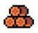
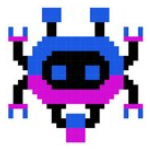

# GDD - Game Design Document - Módulo 1 - Inteli

## Grupo Engage

#### Bruno Carvalho Crusinski 
#### Heitor de Faria Cândido 
#### Kaio Vittor Martins Silva 
#### Mariana de Paula Barbosa Souza 
#### Yasmim Passos

## Sumário

[1. Introdução](#c1)

[2. Visão Geral do Jogo](#c2)

[3. Game Design](#c3)

[4. Desenvolvimento do jogo](#c4)

[5. Casos de Teste](#c5)

[6. Conclusões e trabalhos futuros](#c6)

[7. Referências](#c7)

[Anexos](#c8)

 

# 1. Introdução (sprints 1 e 4)

## 1.1. Escopo do Projeto

### 1.1.1. Contexto da indústria (sprints 1 e 4)

A Oracle é uma das maiores empresas atuais de tecnologia, tendo grande destaque no ramo e sendo referência em segurança cibernética. Produz majoritariamente sistemas e interfaces para bancos de dados, além de uma alta gama de softwares, hardwares e serviços relacionados à computação em nuvem.
Uma de suas ramificações é a Oracle Academy, uma plataforma de capacitação profissional para professores aprenderem a utilizarem melhor em sala de aula as ferramentas Oracle. No entanto, nos últimos anos, com o crescimento da utilização de serviços on-line, o setor educacional voltado para professores aumentou gradativamente, mesmo que ainda tal setor seja preenchido por startups e iniciativas pouco tecnológicas agregando pouco ao letramento digital dos profissionais.

### 1.1.2. Análise SWOT (sprints 1 e 4)

A análise SWOT é uma ferramenta utilizada para analisar os agentes internos e externos que podem influenciar em um determinado espaço, bem como os pontos positivos e negativos que agregam ao resultado final.

#### Análise SWOT (Engage)
| #  | Forças (Strengths)|
| ---| ---               |
| 1. | Produto agradável com boa luminosidade e sonoridade;|
| 2. | Jogo de fácil acesso e jogabilidade;|
| 3. | Cores neutras e visuais pixelados baseadas na modalidade “Cozy Game’ (Confortável, desestressante e aconchegante);|
| 4. | Musicalidade desenvolvida a partir de musicoterapia para concentração e foco;|
| 5. | Dinâmica a partir de pistas e fragmentos para a resolução do enigma, em que o mesmo representa, ao final, a conclusão de uma fase;|
| 6. |Metodologia de instruções gamificadas;|

| #  | Fraquezas (Weaknesses)|
| ---| ---               |
| 1. | Acessível somente para professores acadêmicos;|
| 2. | Formato somente em 2D;|
| 3. | Foco isolado para engajamento e instrução, tornando o público alvo demasiadamente seleto;|
| 4. | Não é adaptável a todas as plataformas e consoles;|
| 5. | Dependente de internet;|
| 6. | Alguns professores podem achar a curva de aprendizado do jogo íngreme, especialmente se não estiverem familiarizados com jogos educativos;|

| #  | Oportunidades (Opportunities)|
| ---| ---               |
| 1. | Escalonamento do produto através de parcerias com escolas e universidades;|
| 2. | Alavancar o compartilhamento do jogo e ressaltar sua importância;|
| 3. | Criação de mais fases para outras ferramentas mais complexas da Oracle;|
| 4. | Recebimento de feedbacks dos professores para futuras melhorias;|
| 5. | Oportunidade de letramento digital;|

| #  | Ameaças (Threats)|
| ---| ---               |
| 1. | Crescimento do mercado de “Serious Games”;|
| 2. | Instruções de cadastro pelo Chat GPT;|
| 3. | Alguns professores podem resistir à adoção de novas tecnologias e métodos de ensino;|

### 1.1.3. Descrição da Solução Desenvolvida (sprints 1 e 4)

Em se tratando de plataformas de ensino virtual, um dos maiores desafios está associado à adoção do aprendizado oriundos destas plataformas em sala de aula pelos professores. 
De acordo com a radiografia anual da TIC na Educação, cerca de 75% do corpo docente carece de uma plataforma para adquirir conhecimentos em ferramentas digitais. O artigo "Saúde Docente: Possibilidades e Limites" de 1999 destaca a tensão e o estresse causados pela desconexão entre as expectativas do sistema educacional e as condições reais dos professores.
Apresentado o cenário, o projeto ENGAGE é um jogo com 5 fases que facilita o cadastro e a compreensão da plataforma Oracle Academy. Cada fase apresenta um novo desafio, sendo cada um dos níveis um aprendizado relevante para o contato com a real plataforma, promovendo a exploração gradual dos recursos da plataforma e incentivando a aprendizagem eficiente dos professores.
Esse jogo deve ser utilizado precedendo o contato com o site da Oracle Academy, para que assim o professor possa aprender com ele a melhor forma de explorar sua interface e suas oportunidades. Portanto, ao criar uma nova ambientação envolvendo educação, jogabilidade e tecnologia, o processo de absorção e engajamento das ferramentas oferecidas se torna muito mais eficaz e memorável.
Para avaliar o sucesso da proposta, serão fornecidos feedbacks ao final de cada jornada do jogador, visando enriquecer a experiência do usuário. Métricas mensais na plataforma da Oracle Academy serão usadas para rastrear a adesão de professores pós-jogo, identificar desistências, medir o êxito das atividades e avaliar a receptividade dos alunos às ferramentas e orientações dos professores.

### 1.1.4. Proposta de Valor (sprints 1 e 4)

### 1.1.5. Matriz de Riscos (sprints 1 e 4)

Dentro da elaboração do projeto Engage, há riscos de execução e finalização dele, sejam esses riscos positivos ou negativos à completude dele. Os riscos são incertezas futuras de um projeto que o impactam de alguma forma. Para analisar melhor os riscos e obter uma resposta planejada e organizada a eles, a matriz de riscos é indispensável.
A matriz de riscos é uma importante ferramenta para avaliar riscos de um produto, serviço, projeto, etc. Com ela, há uma organização maior dos problemas potenciais de um projeto, classificando-os com baixo, médio e alto risco dependendo de sua probabilidade e seu impacto.
Dentre os riscos do projeto engage:

| Risco| Descrição| Validade| Resposta| Plano de ação
|---|---|---|---|---
| Perda de armazenamento do código pelo github.| O github é o espaço utilizado para armazenar o código do jogo desenvolvido. Caso haja algum impedimento de acesso ou uma perda de dados ocasionado por essa plataforma de armazenamento, todo o código poderá ser perdido ou suspenso por um tempo, atrasando o andamento do projeto.| Sem validade.|Haverá uma resposta ativa.| Os integrantes irão armazenar até o final do projeto ao menos sua parte da programação em uma pasta local, diminuindo assim o impacto de uma perda total do código por completo.
|Entraves do código.|O código pode apresentar falhas de funcionamento e apresentar comportamento fora do esperado, sendo prejudicial ao resultado do projeto.|Durante as 5 sprints.|Haverá uma resposta ativa.|Passar por uma análise do grupo, revisando o código e suas marcações. Caso persista ou não for encontrado o problema, deverá ser consultado um professor da área.
|Risco de exposição de dados do projeto.|O armazenamento público do código no Github pode apresentar riscos ao projeto por ceder a outros usuários a possibilidade de plágio do jogo, vazamento de dados do jogo ou mesmo utilização indevida do jogo.|Sem validade.|Haverá uma resposta passiva.|
|Acesso limitado a plataforma pelos desenvolvedores.|Durante o desenvolvimento do projeto, o grupo desenvolvedor do jogo não tem acesso direto a plataforma da Oracle Academy, o que além de prejudicar na compreensão integral dela pelo grupo, o jogo pode não acompanhar atualizações relevantes da plataforma.|Durante as 5 sprints.|Haverá uma resposta passiva.|Produzir o jogo levando em consideração o contato com a plataforma do primeiro sprint.
|Falta de comunicação no grupo.|O grupo pode ter pouco, ou nenhuma comunicação em alguns momentos, o que prejudicará o desenvolvimento do artefato e do projeto por inteiro. A ausência de relatar problemas, a abstenção em pedir ajuda ou mesmo responder a questões do grupo, são todos fatores desse déficit.|Sem validade.|Haverá uma resposta ativa.|Além das dailys e fechamentos rotineiros, o grupo participará ativamente da gestão de todas as partes do projeto, prontificando-se em ajudar e decidindo se alguma tarefa demandará mais apoio. Os integrantes deverão ser honestos e apresentar seu trabalho aos demais durante o processo, reconhecendo dificuldades ou facilidades durante o processo.
|Incompetência técnica de algum integrante em programação.|O projeto é desenvolvido por integrantes em desenvolvimento de suas hard skills de programação, nesse processo algum integrante pode apresentar um déficit o que acarretará em perda de produtividade do grupo e do andamento do projeto.|Sem validade.|Haverá uma resposta ativa.|Os integrantes exercerão a cada sprint uma função mais específica dentro do grupo e na sprint seguinte irão tutelar o próximo responsável por sua função. Desse modo, os novos integrantes de programação poderão compreender a jornada anterior e serão orientados de onde continuar e, caso necessário, diminuir seu déficit com o programador anterior.

## 1.2. Requisitos do Projeto (sprints 1 e 2)

|# | Requisitos - Jogo para Oracle Academy  
--- | ---
| 1. | O jogo deverá seguir a temática de “serious game”, projetada para ensinar, treinar, simular ou resolver problemas em áreas específicas, como educação.
| 2. | O jogo não deverá conter elementos risíveis.
| 3. | O jogo deverá ser em primeira pessoa e não conter nenhum avatar que se mova, apenas um assistente que acompanha o jogador durante toda a jornada.
| 4. | A criação precisará ser desenvolvida com base em 5 fases pré-estabelecidas*
| 5. | Colocar o professor jogador como protagonista da experiência. 
| 6. | A paleta de cores só poderá conter cores pastéis/ sóbrias.
| 7. | As mecânicas do jogo serão de clicar, arrastar, selecionar e digitar.
| 8. | A ambientação do jogo deve obrigatoriamente ser feita em 2D.
| 9. | Não há limites para a quantidade de ambientações, mas todas devem representar cômodos de fácil jogabilidade.
| 10. | Todos os objetos que podem ser movimentados deverão aumentar de tamanho ao serem arrastados para fora do ambiente referido (para melhor visualização do usuário).
| 11. | As fases determinam uma sequência gradativa de desafios. 
| 12. | O jogo deverá ser disponibilizado para acesso via Web Browser.

\* Detalhamento do requisito 4:
* FASE 1: Cadastro
* FASE 2: Conhecendo as plataformas e recursos disponíveis:
    * Navegação nos conteúdos;
    * Inscrição em cursos;
* FASE 3: Canais:
* Criação de canais;
    * Inclusão de conteúdos nos canais;
    * Cadastro de alunos nos canais;
* FASE 4: Cloud:
    * Solicitação de conta cloud;
    * Solicitação de conta cloud para alunos;
* FASE 5: Participação em sessão de suporte ao membro.|

## 1.3. Público-alvo do Projeto (sprint 2)

*Posicione aqui uma descrição justificada do público-alvo do jogo, em termos demográficos e de preferências/gostos pessoais.*

# 2. Visão Geral do Jogo (sprint 2)

## 2.1. Objetivos do Jogo (sprint 2)

*Descreva o que o jogador deve cumprir para avançar ou concluir o jogo*

## 2.2. Características do Jogo (sprint 2)

### 2.2.1. Gênero do Jogo (sprint 2)

*simulação, RPG, corrida, estratégia, esportes, ação, aventura etc.*  

### 2.2.2. Plataforma do Jogo (sprint 2)

*quanto ao dispositivo: desktop, smartphones, tablets, TV etc.*

*quanto ao sistema: Web, Windows, MacOS, Android, IOS etc.*

### 2.2.3. Número de jogadores (sprint 2)

*1 jogador, 2 jogadores versus, 2 jogadores cooperação, multiplayer etc.*

### 2.2.4. Títulos semelhantes e inspirações (sprint 2)

*Liste e descreva títulos semelhantes e jogos que inspiram e são usados como referência do projeto*

### 2.2.5. Tempo estimado de jogo (sprint 5)

*Ex. O jogo pode ser concluído em 3 horas passando por todas as fases.*

*Ex. cada partida dura até 15 minutos*

# 3. Game Design (sprints 2 e 3)

## 3.1. Enredo do Jogo (sprints 2 e 3)

*Descreva o enredo/história do jogo, criando contexto para os personagens (seção 3.2) e o mundo do jogo (seção 3.3). Uma boa história costuma ter um arco narrativo de contexto, conflito e resolução. Utilize etapas sequenciais para descrever esta história.* 

*Caso seu jogo não possua enredo/história (ex. jogo Tetris), mencione os motivos de não existir e como o jogador pode se contextualizar com o ambiente do jogo.*

## 3.2. Personagens (sprints 2 e 3)

### 3.2.1. Controláveis

*Descreva os personagens controláveis pelo jogador. Mencione nome, objetivos, características, habilidades, diferenciais etc. Utilize figuras (character art, sprite sheets etc.) para ilustrá-los. Caso utilize material de terceiros em licença Creative Commons, não deixe de citar os autores/fontes.* 

*Caso não existam personagens (ex. jogo Tetris), mencione os motivos de não existirem e como o jogador pode interpretar tal fato.*

### 3.2.2. Non-Playable Characters (NPC)

*\<opcional\> Se existirem coadjuvantes ou vilões, aqui é o local para descrevê-los e ilustrá-los. Utilize listas ou tabelas para organizar esta seção. Caso utilize material de terceiros em licença Creative Commons, não deixe de citar os autores/fontes. Caso não existam NPCs, remova esta seção.*

### 3.2.3. Diversidade e Representatividade dos Personagens

Considerando as personagens do game, analise se estas estão alinhadas ao público-alvo do jogo (seção 1.3), e compare-as dentro da realidade da sociedade brasileira. Por fim, discorra sobre qual é o impacto esperado da escolha dessas personagens.

## 3.3. Mundo do jogo (sprints 2 e 3)

### 3.3.1. Locações Principais e/ou Mapas (sprints 2 e 3)

*Descreva o ambiente do jogo, em que locais ele ocorre. Ilustre com imagens. Se houverem mapas, posicione-os aqui, descrevendo as áreas em acordo com o enredo. Se houverem fases, descreva-as também em acordo com o enredo (pode ser um jogo de uma fase só). Utilize listas ou tabelas para organizar esta seção. Caso utilize material de terceiros em licença Creative Commons, não deixe de citar os autores/fontes.*

### 3.3.2. Navegação pelo mundo (sprints 2 e 3)

*Descreva como os personagens se movem no mundo criado e as relações entre as locações – como as áreas/fases são acessadas ou desbloqueadas, o que é necessário para serem acessadas etc. Utilize listas ou tabelas para organizar esta seção.*

### 3.3.3. Condições climáticas e temporais (sprints 2 e 3)

*\<opcional\> Descreva diferentes condições de clima que podem afetar o mundo e as fases, se aplicável*

*Caso seja relevante, descreva como o tempo passa, se ele é um fator limitante ao jogo (ex. contagem de tempo para terminar uma fase)*

### 3.3.4. Concept Art (sprint 2)

*Inclua imagens de Concept Art do jogo que ainda não foram demonstradas em outras seções deste documento. Para cada imagem, coloque legendas, como no exemplo abaixo.*

Figura 1: detalhe da cena da partida do herói para a missão, usando sua nave

### 3.3.5. Trilha sonora (sprint 3)

*Descreva a trilha sonora do jogo, indicando quais músicas serão utilizadas no mundo e nas fases. Utilize listas ou tabelas para organizar esta seção. Caso utilize material de terceiros em licença Creative Commons, não deixe de citar os autores/fontes.*

*Exemplo de tabela*
\# | titulo | ocorrência | autoria
--- | --- | --- | ---
1 | tema de abertura | tela de início | própria
2 | tema de combate | cena de combate com inimigos comuns | Hans Zimmer
3 | ... 

## 3.4. Inventário e Bestiário (sprint 3)

### 3.4.1. Inventário

*\<opcional\> Caso seu jogo utilize itens ou poderes para os personagens obterem, descreva-os aqui, indicando títulos, imagens, meios de obtenção e funções no jogo. Utilize listas ou tabelas para organizar esta seção. Caso utilize material de terceiros em licença Creative Commons, não deixe de citar os autores/fontes.* 

*Exemplo de tabela*
\# | item |  | como obter | função | efeito sonoro
--- | --- | --- | --- | --- | ---
1 | moeda |  | há muitas espalhadas em todas as fases | acumula dinheiro para comprar outros itens | som de moeda
2 | madeira |  | há muitas espalhadas em todas as fases | acumula madeira para construir casas | som de madeiras
3 | ... 

### 3.4.2. Bestiário

*\<opcional\> Caso seu jogo tenha inimigos, descreva-os aqui, indicando nomes, imagens, momentos de aparição, funções e impactos no jogo. Utilize listas ou tabelas para organizar esta seção. Caso utilize material de terceiros em licença Creative Commons, não deixe de citar os autores/fontes.* 

*Exemplo de tabela*
\# | inimigo |  | ocorrências | função | impacto | efeito sonoro
--- | --- | --- | --- | --- | --- | ---
1 | robô terrestre |  |  a partir da fase 1 | ataca o personagem vindo pelo chão em sua direção, com velocidade constante, atirando parafusos | se encostar no inimigo ou no parafuso arremessado, o personagem perde 1 ponto de vida | sons de tiros e engrenagens girando
2 | robô voador |  | a partir da fase 2 | ataca o personagem vindo pelo ar, fazendo movimento em 'V' quando se aproxima | se encostar, o personagem perde 3 pontos de vida | som de hélice
3 | ... 

## 3.5. Gameflow (Diagrama de cenas) (sprint 2)

*Posicione aqui seu "storyboard de programação" - o diagrama de cenas do jogo. Indique, por exemplo, como o jogo começa, quais opções o jogador tem, como ele avança nas fases, quais as condições de 'game over', como o jogo reinicia. Seu diagrama deve representar as classes, atributos e métodos usados no jogo.*

## 3.6. Regras do jogo (sprint 3)

*Descreva aqui as regras do seu jogo: objetivos/desafios, meios para se conseguir alcançar*

*Ex. O jogador deve pilotar o carro e conseguir terminar a corrida dentro de um minuto sem bater em nenhum obstáculo.*

*Ex. O jogador deve concluir a fase dentro do tempo, para obter uma estrela. Se além disso ele coletar todas as moedas, ganha mais uma estrela. E se além disso ele coletar os três medalhões espalhados, ganha mais uma estrela, totalizando três. Ao final do jogo, obtendo três estrelas em todas as fases, desbloqueia o mundo secreto.*  

## 3.7. Mecânicas do jogo (sprint 3)

*Descreva aqui as formas de controle e interação que o jogador tem sobre o jogo: quais os comandos disponíveis, quais combinações de comandos, e quais as ações consequentes desses comandos. Utilize listas ou tabelas para organizar esta seção.*

*Ex. Em um jogo de plataforma 2D para desktop, o jogador pode usar as teclas WASD para mecânicas de andar, mirar para cima, agachar, e as teclas JKL para atacar, correr, arremesar etc.*

*Ex. Em um jogo de puzzle para celular, o jogador pode tocar e arrastar sobre uma peça para movê-la sobre o tabuleiro, ou fazer um toque simples para rotacioná-la*

# 4. Desenvolvimento do Jogo

## 4.1. Desenvolvimento preliminar do jogo (sprint 1)

Para a versão preliminar do jogo, foi desenvolvido a tela inicial contendo dois botões com animações perpétuas e três botões com animações ao colocar o mouse em cima, juntamente com a transição para um protótipo do cenário inicial ao clicar no botão "Jogar". Apesar de, atualmente, apenas o botão "Jogar" possuir uma funcionalidade, todos os botões já são clicáveis, ativando o comando console.log com textos distintos para cada um. Originalmente, o programa necessitava do arquivo phaser.js local e o tamanho de tela era fixo, porém na versão atual podemos acessá-lo via web, retirando a dependência do mesmo dentro do diretório, e o tamanho de tela pode se adequar ao dispositivo.

Segue as imagens da página finalizada:

<figure>
    
  <figcaption>Legenda: tela inicial</figcaption>
</figure>

<figure>
    
  <figcaption>Legenda: protótipo do 1º cenário</figcaption>
</figure>

<figure>
    
  <figcaption>Legenda: comandos console.log</figcaption>
</figure>

## 4.2. Desenvolvimento básico do jogo (sprint 2)

*Descreva e ilustre aqui o desenvolvimento da versão básica do jogo, explicando brevemente o que foi entregue em termos de código e jogo. Utilize prints de tela para ilustrar. Indique as eventuais dificuldades e próximos passos.*

## 4.3. Desenvolvimento intermediário do jogo (sprint 3)

*Descreva e ilustre aqui o desenvolvimento da versão intermediária do jogo, explicando brevemente o que foi entregue em termos de código e jogo. Utilize prints de tela para ilustrar. Indique as eventuais dificuldades e próximos passos.*

## 4.4. Desenvolvimento final do MVP (sprint 4)

*Descreva e ilustre aqui o desenvolvimento da versão final do jogo, explicando brevemente o que foi entregue em termos de MVP. Utilize prints de tela para ilustrar. Indique as eventuais dificuldades e planos futuros.*

## 4.5. Revisão do MVP (sprint 5)

*Descreva e ilustre aqui o desenvolvimento dos refinamentos e revisões da versão final do jogo, explicando brevemente o que foi entregue em termos de MVP. Utilize prints de tela para ilustrar.*

# 5. Testes (sprint 4)

## 5.1. Casos de Teste

*Descreva nesta seção os casos de teste comuns que podem ser executados a qualquer momento para testar o funcionamento e integração das partes do jogo. Utilize tabelas para facilitar a organização.*

*Exemplo de tabela*
\# | pré-condição | descrição do teste | pós-condição 
--- | --- | --- | --- 
1 | posicionar o jogo na tela de abertura | iniciar o jogo desde seu início | o jogo deve iniciar da fase 1
2 | posicionar o personagem em local seguro de inimigos | aguardar o tempo passar até o final da contagem | o personagem deve perder uma vida e reiniciar a fase
3 | ...

## 5.2. Testes de jogabilidade (playtests) (sprint 4)

### 5.2.1 Registros de testes

*Descreva nesta seção as sessões de teste/entrevista com diferentes jogadores. Registre cada teste conforme o template a seguir.*

Nome | João Jonas (use nomes fictícios)
--- | ---
Já possuía experiência prévia com games? | sim, é um jogador casual
Conseguiu iniciar o jogo? | sim
Entendeu as regras e mecânicas do jogo? | entendeu as regras, mas sobre as mecânicas, apenas as essenciais, não explorou os comandos complexos
Conseguiu progredir no jogo? | sim, sem dificuldades  
Apresentou dificuldades? | Não, conseguiu jogar com facilidade e afirmou ser fácil
Que nota deu ao jogo? | 9.0
O que gostou no jogo? | Gostou  de como o jogo vai ficando mais difícil ao longo do tempo sem deixar de ser divertido
O que poderia melhorar no jogo? | A responsividade do personagem aos controles, disse que havia um pouco de atraso desde o momento do comando até a resposta do personagem

### 5.2.2 Melhorias

*Descreva nesta seção um plano de melhorias sobre o jogo, com base nos resultados dos testes de jogabilidade*

# 6. Conclusões e trabalhos futuros (sprint 5)

*Escreva de que formas a solução do jogo atingiu os objetivos descritos na seção 1 deste documento. Indique pontos fortes e pontos a melhorar de maneira geral.*

*Relacione os pontos de melhorias evidenciados nos testes com plano de ações para serem implementadas no jogo. O grupo não precisa implementá-las, pode deixar registrado aqui o plano para futuros desenvolvimentos.*

*Relacione também quaisquer ideias que o grupo tenha para melhorias futuras*

# 7. Referências (sprint 5)

_Incluir as principais referências de seu projeto, para que seu parceiro possa consultar caso ele se interessar em aprofundar. Um exemplo de referência de livro e de site:_ 

LUCK, Heloisa. Liderança em gestão escolar. 4. ed. Petrópolis: Vozes, 2010.  
SOBRENOME, Nome. Título do livro: subtítulo do livro. Edição. Cidade de publicação: Nome da editora, Ano de publicação.  

INTELI. Adalove. Disponível em: https://adalove.inteli.edu.br/feed. Acesso em: 1 out. 2023  
SOBRENOME, Nome. Título do site. Disponível em: link do site. Acesso em: Dia Mês Ano

# Anexos

*Inclua aqui quaisquer complementos para seu projeto, como diagramas, imagens, tabelas etc. Organize em sub-tópicos utilizando headings menores (use ## ou ### para isso)*
